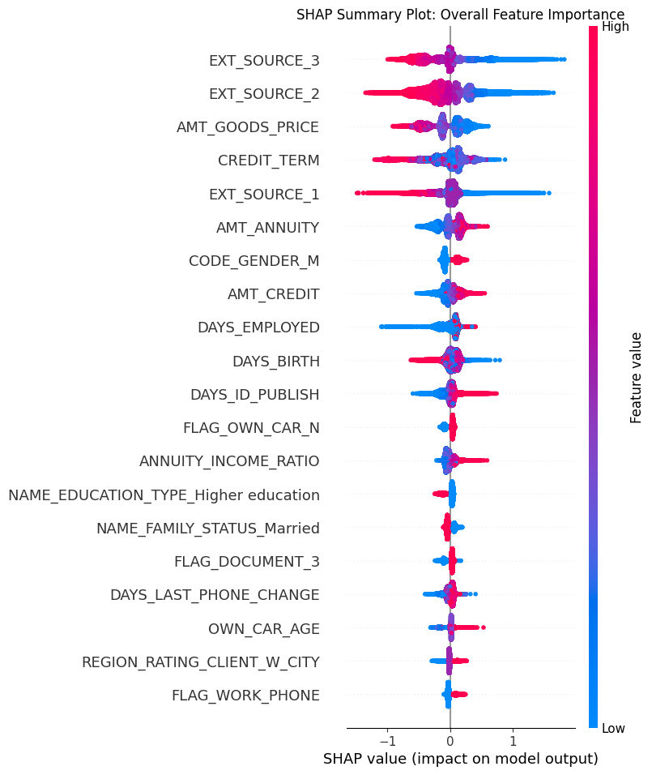

# Explainable AI (XAI) Credit Risk Prediction Web App

[](https://huggingface.co/spaces/swayam279/credit-risk-explanation)

This project is a complete, end-to-end data science application that predicts the risk of a loan applicant defaulting. It features a full-stack web interface built with Flask and provides not only a real-time risk score but also a human-readable explanation of the model's decision-making process using SHAP.

---

### **Live Demo**

The application is deployed and publicly accessible on Hugging Face Spaces.

**[➡️ Click here to access the live application](https://huggingface.co/spaces/swayam279/credit-risk-explanation)** <!-- Replace with your HF Space URL -->

---

## **Project Overview**

This project demonstrates a full MLOps lifecycle, starting from a raw dataset and ending with a deployed, interactive, and explainable AI product.

### **Key Features:**

-   **Data Persistence:** Uses a local **MongoDB** instance for robust data management, moving beyond static CSV files.
-   **High-Performance Modeling:** Utilizes a tuned **XGBoost** model, a state-of-the-art algorithm for tabular data, optimized with **Optuna**.
-   **Explainable AI (XAI):** Integrates the **SHAP** library to provide transparent, feature-level explanations for every prediction, building trust and 
    interpretability.
-   **Web Application:** A user-friendly frontend built with **HTML/CSS** and a backend powered by **Flask**.
-   **Containerized for Deployment:** The entire application is containerized using **Docker**, ensuring portability and consistent execution.
-   **Cloud Hosted:** Deployed for free on **Hugging Face Spaces**, making the application globally accessible.

### **Model Interpretation**

The model's decisions are explained using SHAP. The summary plot below shows the most important features that influence the model's predictions globally.



---

## **How to Run Locally**

1.  **Clone the repository:**
    ```bash
    git clone [https://github.com/swayam279/Credit-Risk.git](https://github.com/swayam279/Credit-Risk.git)
    cd Credit-Risk
    ```

2.  **Install dependencies:**
    ```bash
    pip install -r Requirements.txt
    ```
    
3.  **Run the Flask application:**
    ```bash
    flask run
    ```
    
4.  Open your browser and navigate to `http://127.0.0.1:5000`.